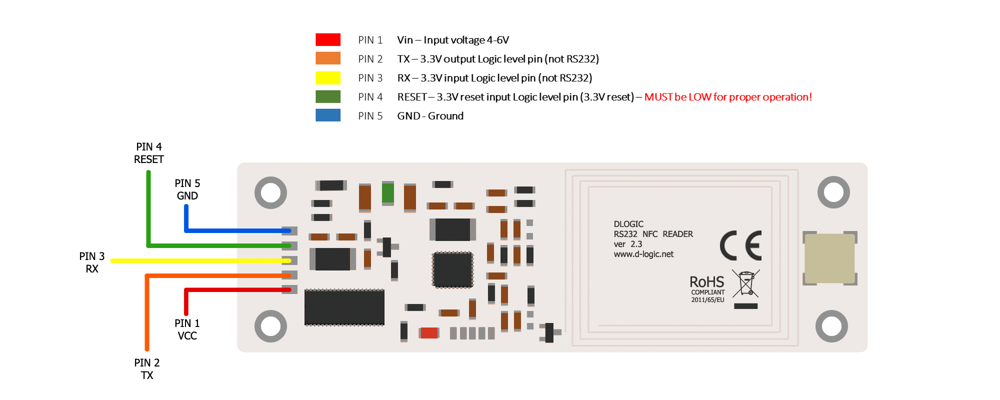

# ufr-arduino-esp-examples-getuid_wifi_send

Arduino source code example for reading card UID with Espressif controller and send it on PHP server. PHP scripts also included.

# uFR Nano RS232 Pinout

